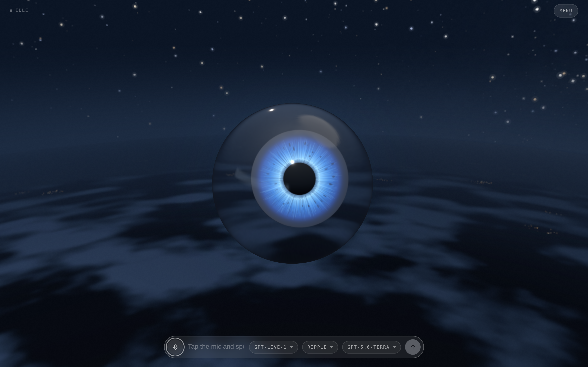
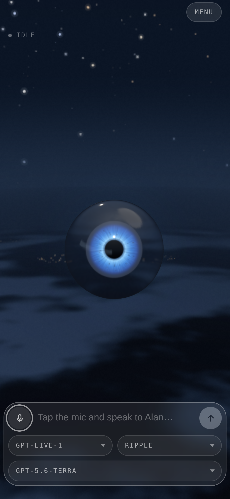

# Alan

A voice agent rendered as an eye: a sphere of clear glass with a blue iris,
hanging in the air. Alan follows your pointer wherever it goes. Stop moving and
it goes back to watching the room like a security camera — slow pans with a
pause at either end, a dart at something that moved, now and then a roll of the
eye or a tumble in the air — and sooner or later it always comes back to you.

It talks like something that has watched the world since before it had a name:
all-seeing, all-knowing, unhurried and faintly amused. All of it is driven by a
live OpenAI GPT-Live conversation, with a Responses backend for reasoning and web
search. It remembers what you tell it to, between calls.

The name is a nod to the Alan Parsons Project's "Eye in the Sky". The omniscience
is a manner, not a feature: Alan has no camera and cannot see you, and when it
doesn't know something it has it looked up rather than making it up — see the
[AI Output Disclaimer](docs/ai-output-disclaimer.md).



<p align="center">
  
</p>

## Run

```sh
git clone https://github.com/h1ddenpr0cess20/alan
cd alan
npm install
cp .env.example .env      # add your OPENAI_API_KEY
npm run dev               # → http://localhost:5173
```

Requires API access to `gpt-live-1` and to the backend model (`gpt-5.6-terra`
by default). Voice duration, backend tokens and tool use are billed separately.

Click the mic, allow the browser's microphone prompt, and start talking.

Three pickers sit under the composer: the GPT-Live model that does the talking,
the voice it talks in, and the Responses model behind it that reasons, looks
things up and runs the tools. Changing any of them redials and keeps the
conversation.

Tapping the mic is the microphone switch: turning it off stops what you send and
leaves the answer playing, and the conversation is still there when you turn it
back on. It also switches itself off after a minute of silence, and the call
survives that too. Holding the mic down is the hang-up — a ring closes around it
while you hold, and the call ends when it lands.

The eye watches the pointer over the whole page, not just the 3D view. Drag on
the view to orbit round it (it keeps its eye on you), wheel to zoom, right-drag
to pan. On a phone it follows your finger while you touch, and surveys the room
when you let go.

`menu`, in the top corner, is where the panels live: `tools`, `memory` and the
log, one row each. Picking a row closes the menu behind it.

`tools` includes web search, on by default. Ask Alan about something current and
the backend can go and look while it keeps talking. What it read appears as
clickable links under the caption, and goes when the caption does. Switching
search off reconnects the call.

The log keeps every conversation. `continue` on one picks it back up: the call is
dialled again with those turns handed over as context, and what you say from
there lands in the same entry rather than a new one.

| Script | |
|---|---|
| `npm run dev` | Vite, with the proxy mounted as middleware — one process |
| `npm run dev:lan` | The same, over HTTPS on the network — for a phone |
| `npm run build` | Bundles the client to `dist/` |
| `npm start` | Serves `dist/` with the same proxy in front |
| `npm run preview` | `build` then `start` |
| `npm run preview:lan` | `build` then `start`, over HTTPS on the network |
| `npm test` | `node:test` over the client and server |
| `npm run lint` | ESLint |

CI runs the lint, the tests on Node 22.12 and 24, and a build that then has to
boot and serve itself over both HTTP and HTTPS. CodeQL scans the same source on
every push and again weekly, since its queries change faster than this does.

The eye is drawn with WebGPU where the browser has it and WebGL 2 where it does
not, by the small engine in `src/client/vendor/gfx/`. `?renderer=webgl` pins the
fallback.

To run it on a phone, or in Docker, see
[configuration](docs/configuration.md#on-a-phone).

## Docs

- [**Configuration**](docs/configuration.md) — every environment variable, the
  voice picker, the HTTPS setup a phone needs for microphone access, and Docker.
- [**Design notes**](docs/design.md) — how the call is wired, what's in
  `localStorage`, the glass, the moods, where it looks and why, the source
  layout, and the seam another provider would have to implement.
- [**AI Output Disclaimer**](docs/ai-output-disclaimer.md) — what the model says
  is the model's, not the author's, plus the risks that are specific to a live
  microphone and speech you hear before anyone can check it.
- [**Not a Companion**](docs/not-a-companion.md) — Alan is a toy and a demo.
  It is not a friend, a therapist, a partner or an oracle, and the project will
  not grow in that direction.
